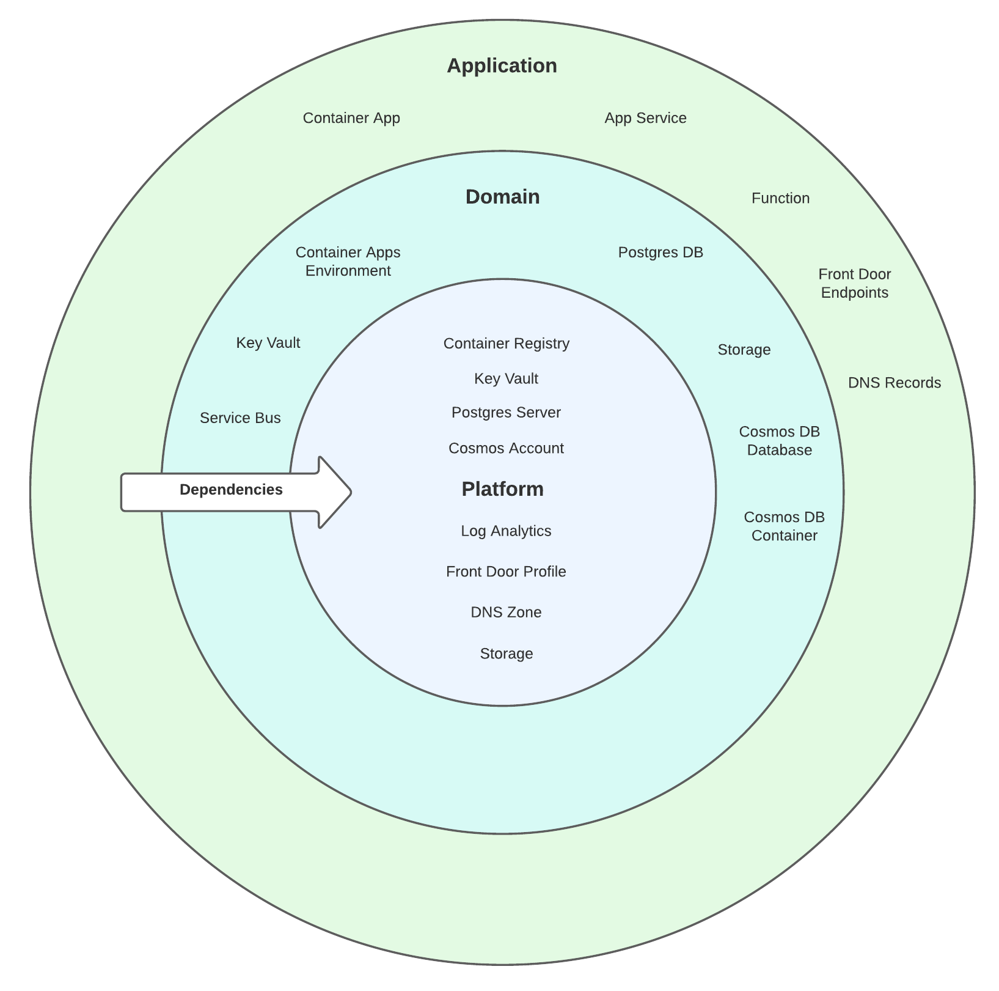

# azure-bicep-examples

Infrastructure as code using Azure Bicep and GitHub Actions

# Introduction

This repository demonstrates how to write infrastructure-as-code using [Bicep](https://github.com/Azure/bicep) (a Domain Specific Language for deploying resources on Azure) and how to write CI/CD pipelines using [GitHub Actions](https://github.com/features/actions).

This repository contains end-to-end examples of Node & Laravel (PHP) apps deployed to [App Service](https://azure.microsoft.com/en-au/services/app-service/) and [Azure Container Apps](https://azure.microsoft.com/en-us/services/container-apps/). The examples deploy additional resources such as [Container Registry](https://azure.microsoft.com/en-us/services/container-registry/), [Service Bus](https://azure.microsoft.com/en-us/services/service-bus/), [Postgres](https://azure.microsoft.com/en-us/services/postgresql/) & [Cosmos](https://azure.microsoft.com/en-us/services/cosmos-db/) database, [storage](https://azure.microsoft.com/en-us/services/storage/blobs/) accounts, [Key Vault](https://azure.microsoft.com/en-us/services/key-vault/) and configure [Front Door](https://azure.microsoft.com/en-us/services/frontdoor/) load balancer and [Azure DNS](https://azure.microsoft.com/en-us/services/dns/).

Infrastructure has been laid out as tiers based on the foundation `platform` tier. The platform resources are likely to be organisation-wide shared resources and defined once. The `domain` tier builds on this and provides resources shared across applications in the same domain. Finally the `application` tiers defines app or service-specific resources.



Resource names have been defined in json files. You'll find these as `*-infra.json` files in the `.bicep` folder. Defining these one-time allows different modules and workflows to access these resources without duplicating resource names across the iac files. It also provides an easy way to manage and update resource names without hunting through the code.

## Sample apps


| App | Stack | Deployment Target |
| -- | -- | -- |
| app1 | NestJs (Node) | Container Apps |
| app2 | Laravel (PHP) | Container Apps |
| app3 | NestJs (Node) | App Service |
| app4 | Laravel (PHP) | App Service |

## Running examples locally

Later in this guide you'll find a walkthrough how to run the scripts locally. **Note:** You'll probably need to change some of the resource names in infra json files and other settings to avoid naming conflicts due to some of the global Azure naming restrictions.

## Running GitHub Actions pipelines

The examples come complete with GitHub Actions workflows. However these require some initial set-up of secrets such as Service Principal, credentials, Azure subscription details. The quick start guide details these settings.

# Quick Start

You'll probably need to change the following:

- domain name in `*-infra.json` files
- Update your domain's nameserver records on completion of platform provisioning to point to Azure DNS

## Local Testing

Login to Azure:

```bash
az login
```

List subscriptions:

```bash
az account list --output table
```

Select one of your listed subscriptions:

```bash
az account set --subscription <Subscription Id>
```

Create platform resources:

```bash
az group create --name rg-bicep-examples-plat --location australiaeast
az deployment group create --name dp-platform-infra-au --resource-group rg-bicep-examples-plat --template-file .bicep/platform-infra.bicep --parameters postgresPassword=<super secure password>
```

Create domain resources:

```bash
az group create --name rg-bicep-examples-dmn --location australiaeast
az deployment sub create --name dp-domain-infra-au --template-file .bicep/domain-infra.bicep --location australiaeast --parameters platformResourceGroup=rg-bicep-examples-plat domainResourceGroup=rg-bicep-examples-dmn
```

Create app resources:

```bash
az deployment sub create --name dp-app1-infra-au --template-file .bicep/app1-infra.bicep --location australiaeast --parameters platformResourceGroup=rg-bicep-examples-plat domainResourceGroup=rg-bicep-examples-dmn dockerImage=mcr.microsoft.com/azuredocs/containerapps-helloworld:latest
az deployment sub create --name dp-app2-infra-au --template-file .bicep/app2-infra.bicep --location australiaeast --parameters platformResourceGroup=rg-bicep-examples-plat domainResourceGroup=rg-bicep-examples-dmn dockerImage=mcr.microsoft.com/azuredocs/containerapps-helloworld:latest
az deployment sub create --name dp-app3-infra-au --template-file .bicep/app3-infra.bicep --location australiaeast --parameters platformResourceGroup=rg-bicep-examples-plat domainResourceGroup=rg-bicep-examples-dmn
az deployment sub create --name dp-app4-infra-au --template-file .bicep/app4-infra.bicep --location australiaeast --parameters platformResourceGroup=rg-bicep-examples-plat domainResourceGroup=rg-bicep-examples-dmn
```

Delete resources:

```bash
az group delete --name rg-bicep-examples-dmn
az group delete --name rg-bicep-examples-plat
```

## Setting up GitHub pipelines

### GitHub Actions Secrets

Create the following repository secrets:

| Secret | Description |
| -- | -- |
| AZ_CREDS | Subscription-scoped Service [Principal](https://docs.microsoft.com/en-us/cli/azure/create-an-azure-service-principal-azure-cli). |
| POSTGRES_PASSWORD | Desired admin password. Should meet minimum password requirements |
| SP_NAME | Name of the Subscription-scoped Service Principal |
| SUBSCRIPTION_ID | Azure Subscription Id. Run `az account list --output table` |

### Pipelines

Run pipelines in order:

1. Provision Platform resources with Bicep
2. Provision Domain resources with Bicep
3. Provision App3 resources with Bicep
4. Provision App4 resources with Bicep
5. Build App1 (Nest Container App)
6. Build App2 (Laravel Container App)
7. Build App3 (Nest App Service)
8. Build App4 (Laravel App Service)

# Bicep code


